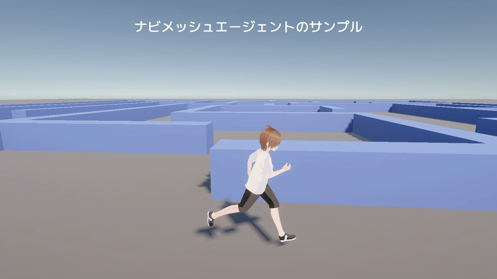

# vroid-game-template

## 💡 動機

このプロジェクトは、VRoidアバターを扱うUnity向けのオープンソース（MITライセンス）テンプレートです。

Unityプロジェクトの初期セットアップには多くのノウハウと時間が必要ですが、[CoderDojo](https://coderdojo.jp/)の活動を通じて、セットアップ作業に苦労するニンジャたちを見て、より簡単に始められる仕組みを作ろうと考えました。

このテンプレートは、Unityを使い始めた誰もが一度は挑戦したい次のようなことを、すぐに実現できるよう設計されています。

- VRoidで作成した自分だけの3DキャラクターをUnity上に表示する
- キャラクターをキーボードやマウスで自由に操作する
- 目標地点までキャラクターを歩かせたり走らせたりする

さらに、以下のような時間のかかる作業を自動化・簡素化しています。

- 各種パッケージの導入やTextMesh Proによる日本語表示など、面倒なセットアップを自動化
- Unity Asset Storeのアセットなど、ライセンス上同梱できない素材も、手順に従って簡単に導入可能
- ソースコードはMITライセンス、同梱アセットは無料素材のみを使用し、誰でも安心して利用できる

---

## 🚀 Quick Start

1. [Release](https://github.com/naoji3x/vroid-game-template/releases)から最新版をダウンロード、またはリポジトリをクローン／テンプレートとして新規リポジトリを作成してください。
2. Unity HubまたはUnity本体でプロジェクトを開きます。ちなみにUnityのバージョンはダウンロードファイル名に記載されています。
   **注意:** Unity 6000.0 LTS以降でのみ動作します。必ず対応バージョンを使用してください。
3. 「このプロジェクトの初期セットアップ手順」ダイアログが表示されるので、案内に従ってセットアップを完了してください。
4. サンプルとして `Assets/Common/Sample/Scenes` に 自動で目的地まで移動する`NavMeshSample`とキーボードで操作する`ThirdPersonSample`シーンが含まれています。これらを開いて実行し、動作を確認できます。
5. サンプルを参考に、独自のシーンや機能を追加してプロジェクトを発展させましょう！`Assets/Scenes`にコピーして使うことをお勧めします。

---

## 🛠 開発環境

- Unity 6000 LTS Universal 3D Template
- UniVRM 0.129.3 (VRM 1.0 対応)

---

## 📂 同梱アセットとライセンス

### 1. ソースコード

- **ライセンス:** MIT License
- 詳細は [LICENSE](LICENSE) ファイルを参照

### 2. VRMファイル

- **ライセンス:** 各VRMファイルに埋め込まれた利用許諾条件に従ってください。
- 作者や利用条件は、VRMファイルの `meta` 情報から確認できます。
- 本プロジェクト同梱の `SampleGirl.vrm` については以下の通りです：
  - 利用許可：すべてのユーザー
  - 表現の制限：暴力・性的・政治的・宗教的・反社会的表現は禁止
  - 商用利用：個人・法人ともに可能
  - 再配布：可能
  - 改変および改変モデルの再配布：可能
  - クレジット表記：不要
- その他のVRMファイルを利用する場合は、それぞれのファイルの利用条件を必ずご確認ください。

---

## 📜 ライセンス

### MIT License（ソースコード部分）

Copyright (c) 2025 Tiny Shrine

Permission is hereby granted, free of charge, to any person obtaining a copy
of this software and associated documentation files (the "Software"), to deal
in the Software without restriction, including without limitation the rights
to use, copy, modify, merge, publish, distribute, sublicense, and/or sell
copies of the Software, and to permit persons to whom the Software is
furnished to do so, subject to the following conditions:

The above copyright notice and this permission notice shall be included in
all copies or substantial portions of the Software.

THE SOFTWARE IS PROVIDED "AS IS", WITHOUT WARRANTY OF ANY KIND, EXPRESS OR
IMPLIED, INCLUDING BUT NOT LIMITED TO THE WARRANTIES OF MERCHANTABILITY,
FITNESS FOR A PARTICULAR PURPOSE AND NONINFRINGEMENT. IN NO EVENT SHALL THE
AUTHORS OR COPYRIGHT HOLDERS BE LIABLE FOR ANY CLAIM, DAMAGES OR OTHER
LIABILITY, WHETHER IN AN ACTION OF CONTRACT, TORT OR OTHERWISE, ARISING FROM,  
OUT OF OR IN CONNECTION WITH THE SOFTWARE OR THE USE OR OTHER DEALINGS IN
THE SOFTWARE.

---

## 🙏 Credits

- Unity 6000 LTS Universal 3D Template
- UniVRM
- LitMotion
- Smart Addresser
- UniTask
- UI Effect
- VContainer
- VRM 1.0
- R3
